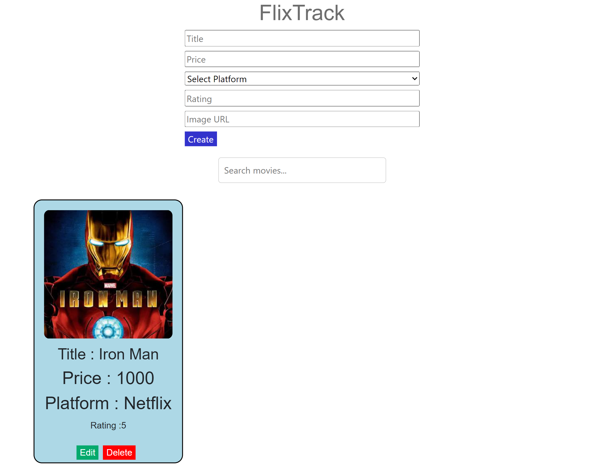

# 🎬 React Movie Management System

A modern and responsive **Movie Management System** built with **React.js**. This application allows users to manage their movie collection through **Create, Read, Update, Delete (CRUD)** operations and provides a simple search feature for quickly finding movies.

---

## 🏷️ Tech Stack


---

## 📸 Application Preview

<p align="center">
  
</p>

---

## 🚀 Live Demo

🌐 **Live Website**

https://balajiinfo8.github.io/React-MovieRecommendationApp/

---

## 💻 Source Code

GitHub Repository

https://github.com/balajiinfo8/React-MovieRecommendationApp

---

# ✨ Features

- 🎬 Add new movies
- ✏️ Update existing movie details
- 🗑️ Delete movies
- 🔍 Search movies instantly
- 🖼️ Display movie posters
- ⚡ Responsive user interface
- ♻️ Reusable React Components
- ⚙️ Fast development using Vite

---

# 📌 Project Highlights

| Feature | Status |
|----------|--------|
| CRUD Operations | ✅ |
| Search Functionality | ✅ |
| Responsive UI | ✅ |
| React Components | ✅ |
| React Hooks | ✅ |
| State Management | ✅ |
| GitHub Pages Deployment | ✅ |

---

# 🛠️ Tech Stack

## Frontend

- React.js
- JavaScript (ES6+)
- HTML5
- CSS3
- Vite

## Development Tools

- Git
- GitHub
- Visual Studio Code

---

# 📂 Project Structure

```text
React-MovieRecommendationApp-main/
│
├── data/
├── public/
├── screenshots/
│   └── home.png
├── src/
├── README.md
├── package.json
├── package-lock.json
├── vite.config.js
└── index.html
```

---

# ⚙️ Installation

## Clone the Repository

```bash
git clone https://github.com/balajiinfo8/React-MovieRecommendationApp.git
```

---

## Navigate to the Project

```bash
cd React-MovieRecommendationApp
```

---

## Install Dependencies

```bash
npm install
```

---

## Run the Development Server

```bash
npm run dev
```

---

## Open in Browser

```text
http://localhost:5173
```

---

# 📖 Key Concepts Demonstrated

- React Functional Components
- React Hooks
- State Management
- CRUD Operations
- Search Functionality
- Component Reusability
- Event Handling
- Responsive Web Design
- Project Deployment using GitHub Pages

---

# 📷 Screenshots

## 🏠 Home Page

<p align="center">
  
</p>

---

# 🚀 Future Improvements

- 🔐 User Authentication
- 🌙 Dark Mode
- ❤️ Favourite Movies
- ⭐ Movie Ratings
- 🎭 Movie Categories
- 📄 Pagination
- 🎞️ Movie Trailer Support
- 🔗 Backend Integration using Django REST Framework
- 🗄️ MySQL Database Integration
- 🔑 JWT Authentication

---

# 👨‍💻 Author

## Balaji Vinothkumar

**Python Backend Developer | Django | Django REST Framework | Learning React**

📧 **Email**

balajivinothkumar.dev@gmail.com

💼 **LinkedIn**

https://www.linkedin.com/in/balaji-vinothkumar

🌐 **Portfolio**

https://balajiinfo8.github.io/portfolio/

💻 **GitHub**

https://github.com/balajiinfo8

---

# 🤝 Contributing

Contributions, suggestions, and feature requests are welcome.

If you would like to improve this project, feel free to fork the repository and submit a pull request.

---

# ⭐ Support

If you found this project useful, consider giving it a ⭐ on GitHub.

It helps others discover the project and motivates me to continue building and sharing open-source projects.

---

<p align="center">
Made with ❤️ using React.js
</p>